# Beyond Demographics: LLM 생성 합성 한국어 페르소나의 사이코그래픽 군집 분석

**작성일**: 2026-05-05
**상태**: Phase 1 완료 (NB01–03) · Phase 2 완료 (NB04)
**저자**: Roh, Lucy

---

## 1. 개요

### 1.1 연구 배경 및 동기

UX 연구에서 페르소나(persona)는 사용자 집단을 대표하는 가상 인물로 활용된다. 최근 NVIDIA의 Nemotron-Personas-Korea처럼 LLM이 대규모 합성 페르소나를 생성하는 사례가 늘고 있으나, 이렇게 생성된 데이터가 인구통계 고정관념을 재생산하는지, 또는 실제 행동·가치관 다양성을 포착하는지는 검증된 바 없다.

본 연구는 LLM 생성 합성 페르소나에서 **인구통계 레이블 없이** 행동 텍스트와 가치관 텍스트만으로 의미 있는 사이코그래픽(psychographic) 군집을 추출할 수 있는지 실증적으로 검토한다. 나아가 생성된 군집이 인구통계와 어느 정도 연관되는지, LLM 생성 과정에서 특정 언어 패턴이 과잉 생성되는지를 분석한다.

### 1.2 연구 질문

1. **RQ1**: 행동 텍스트만으로 인구통계와 독립적인 사이코그래픽 군집 추출이 가능한가?
2. **RQ2**: 가치관 텍스트(Layer A)와 행동 텍스트(Layer B)는 독립적인 레이어를 형성하는가?
3. **RQ3**: LLM이 생성한 한국어 페르소나에서 사회성(sociality) 키워드가 과잉 표현되는가?

### 1.3 데이터셋

**Nemotron-Personas-Korea** (NVIDIA, 2026)

| 항목 | 내용 |
|------|------|
| 총 행 수 | 1,000,000 |
| 총 열 수 | 26 |
| 결측치 | 0% |
| 주요 컬럼 (Layer A) | `persona`, `cultural_background`, `career_goals_and_ambitions` |
| 주요 컬럼 (Layer B) | `hobbies_and_interests`, `sports_persona`, `arts_persona`, `travel_persona`, `culinary_persona` |
| 인구통계 컬럼 | `age`, `sex`, `region`, `education`, `marital_status` 등 |

---

## 2. NB01 — 탐색적 데이터 분석 (Exploratory Data Analysis)

### 2.1 인구통계 분포

#### 성별 (Sex)
| 구분 | 수 | 비율 |
|------|-----|------|
| 여자 | 504,442 | 50.44% |
| 남자 | 495,558 | 49.56% |

#### 연령 (Age)
- 평균: **50.7세** · 중앙값: **51.0세** · 범위: 19–99세
- 분포는 전 연령대에 비교적 고르게 형성됨

#### 학력 (Education)
| 구분 | 비율 |
|------|------|
| 고등학교 | 33.14% |
| 4년제 대학교 | 27.13% |
| 2–3년제 전문대학 | 15.02% |
| 중학교 | 8.53% |
| 초등학교 | 8.12% |
| 대학원 | 5.43% |
| 무학 | 2.63% |

#### 혼인 상태 (Marital Status)
| 구분 | 비율 |
|------|------|
| 배우자있음 | 59.25% |
| 미혼 | 25.70% |
| 사별 | 8.79% |
| 이혼 | 6.26% |

### 2.2 텍스트 길이 통계

| 컬럼 | 평균 | 최소 | 최대 |
|------|------|------|------|
| persona | 81자 | 42자 | 174자 |
| cultural_background | 135자 | 55자 | 299자 |
| career_goals_and_ambitions | 118자 | 47자 | 243자 |
| hobbies_and_interests | 129자 | — | — |
| sports_persona | 134자 | — | — |
| arts_persona | 138자 | — | — |
| travel_persona | 135자 | — | — |
| culinary_persona | 142자 | — | — |

### 2.3 주요 발견

**연령대별 TF-IDF 키워드**
| 연령대 | 대표 키워드 |
|--------|-------------|
| 20대 | 청년, 친구, 자신, 안정, 새로운 |
| 30대 | 퇴근, 업무, 아이, 아내, 스트레스 |
| 40대 | 아이, 업무, 학교, 자식, 퇴근 |
| 50대 | 베테랑, 가장, 아내, 자녀, 퇴근 |
| 60대 | 자녀, 손주, 생활, 아내, 봉사 |
| 70대 | 손주, 여행, 자녀, 건강, 산책 |
| 80대이상 | 손주, 건강, 자녀, 여행, 시간 |

**교차 인구통계 인사이트**
- **30대_여자**: "아이" + "업무" 공동 출현 → 돌봄-노동 이중 부담 반영
- **30대_남자**: "스트레스"가 타 집단 대비 두드러짐 → 사회 진입기 긴장감
- **50대_남자**: "베테랑" + "가장" → 경력 정점과 가계 책임의 중첩

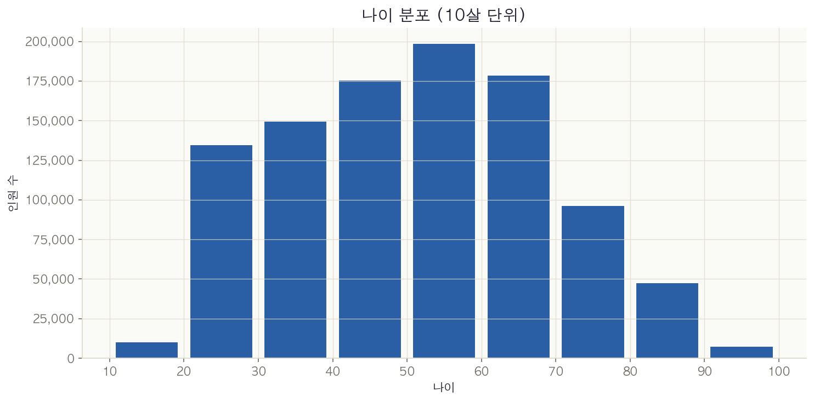
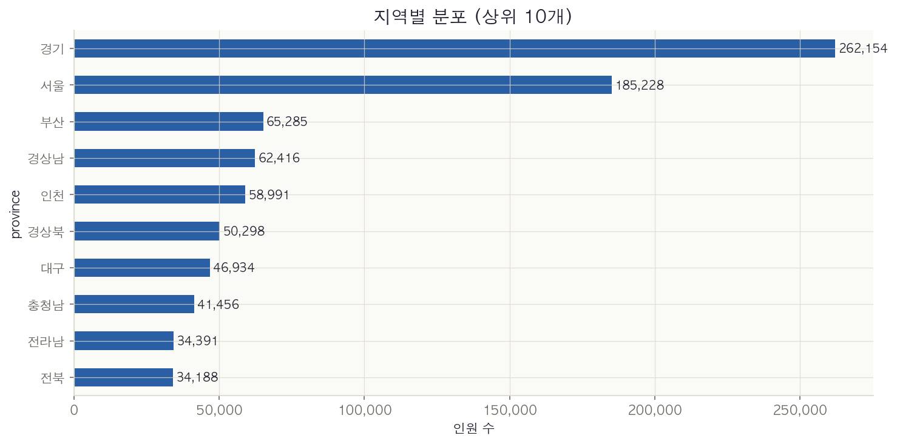
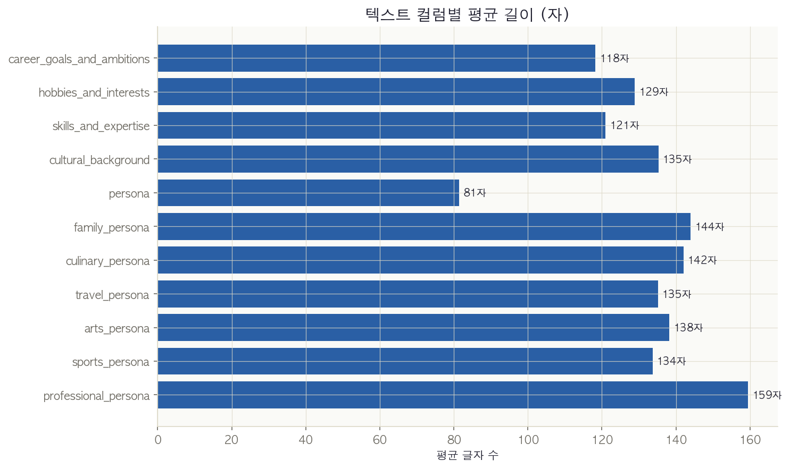

---

## 3. NB02 — 행동 기반 군집화 (Behavioral Clustering)

### 3.1 데이터 준비

- **표본 크기**: 21,000행 (연령대별 3,000행 × 7개 집단)
- **입력 텍스트**: Layer B 5개 컬럼 연결 (평균 682자)
- **형태소 분석**: kiwipiepy (NNG·NNP 태그 명사 추출) → 행당 평균 90.3개 명사

### 3.2 임베딩 비교: TF-IDF+SVD vs Sentence Transformer

| 옵션 | 방식 | 차원 | Silhouette |
|------|------|------|-----------|
| A | TF-IDF (5,000 features) + SVD 300D | 300D | 0.2621 |
| **B** | **jhgan/ko-sroberta-multitask** | **768D** | **0.4126** |

→ **옵션 B 채택** (Silhouette 0.4126, +57.4%)

SVD 누적 설명 분산(300D): **37.4%** — 텍스트 정보의 과반이 손실됨을 확인.

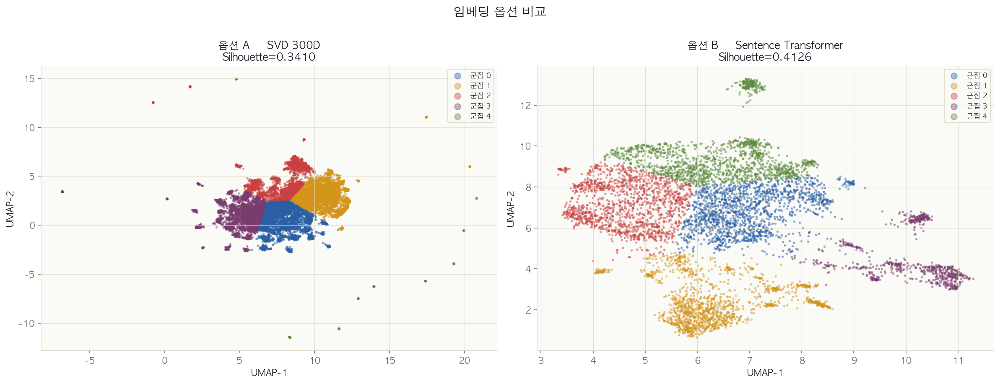
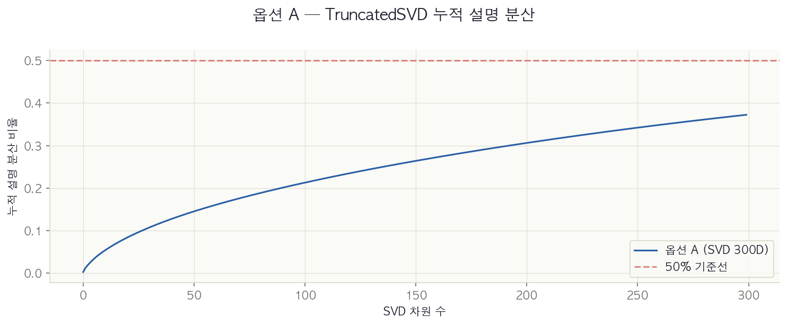

### 3.3 UMAP 파이프라인 효과

K-Means를 직접 768D 공간에서 적용하면 차원의 저주(curse of dimensionality)로 Silhouette이 낮게 나타난다. UMAP으로 50D로 축소한 뒤 군집화하면 분리도가 대폭 개선된다.

| 단계 | Silhouette |
|------|-----------|
| 원본 768D | 0.0534 |
| UMAP 50D | **0.6018** |
| **개선율** | **+1,027%** |

→ 768D → UMAP 50D 파이프라인의 필요성 정량 입증.

### 3.4 K 선택 (K=4)

| K | Inertia | Silhouette | Davies-Bouldin |
|---|---------|-----------|----------------|
| 3 | 19,309 | 0.5648 | 0.6739 |
| **4** | **12,992** | **0.6018 ★** | **0.5551 ★** |
| 5 | 10,776 | 0.3676 | 0.9354 |
| 6 | 9,104 | 0.3884 | 0.8736 |
| 7 | 7,604 | 0.4046 | 0.8688 |
| 8 | 6,443 | 0.3922 | 0.8717 |
| 9 | 5,529 | 0.4071 | 0.8619 |
| 10 | 4,712 | 0.4309 | 0.7865 |

K=4에서 Silhouette 최대(0.6018)·Davies-Bouldin 최소(0.5551) 동시 달성 → **K=4 채택**.

HDBSCAN 비교: 5군집·노이즈 7.6%. 초기 파라미터(min_cluster_size=50)에서 28군집·23.5% 노이즈 → 과세분화. K-Means 채택.

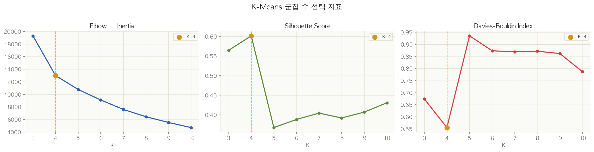
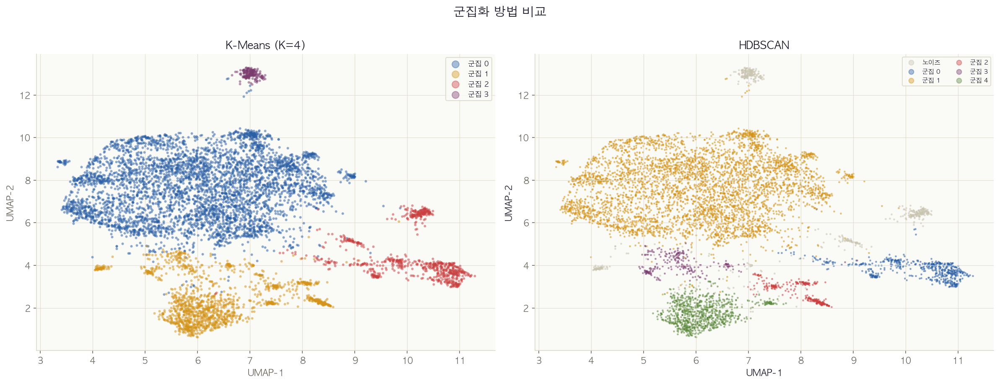

### 3.5 군집 4개 설명

| 군집 | 이름 | 크기 | 비율 | 대표 키워드 |
|------|------|------|------|-------------|
| 0 | 일상·관계 중심형 | 4,559 | 65.1% | 시간, 주말, 동네, 친구, 가족, 여행, 풍경, 마음 |
| 1 | 액티브 스포츠형 | 1,499 | 21.4% | 시간, 주말, 동네, 친구, **배드민턴**, 가족, 여행 |
| 2 | 집·관람 중심형 | 770 | 11.0% | 시간, 주말, **경기**, 동네, 친구, 가족, 역사, 경주 |
| 3 | 반려동물 일상형 | 172 | 2.5% | 시간, **반려견**, 주말, 친구, 가족, 여행, 산책 |

군집 2는 유적지·역사 관련 키워드(경주, 불국사, 부여)가 특징적으로 나타남.

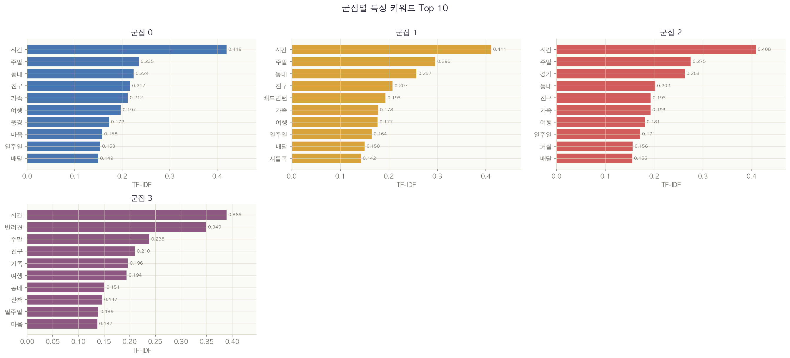

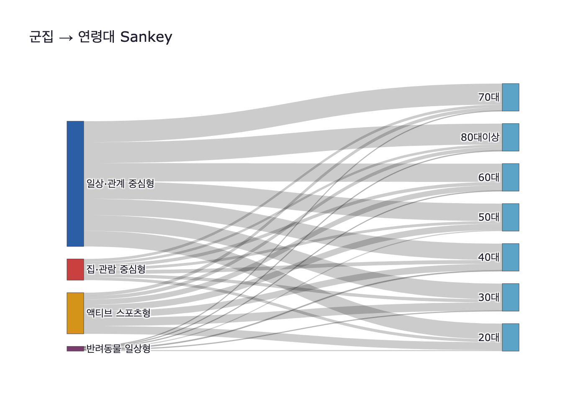
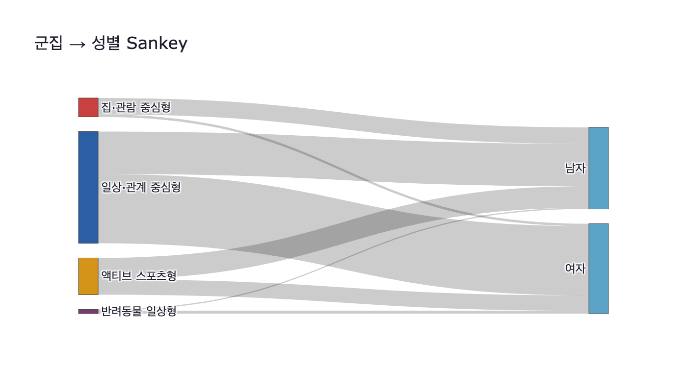
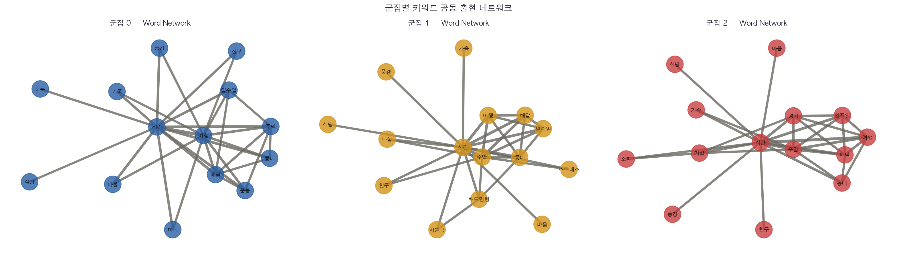
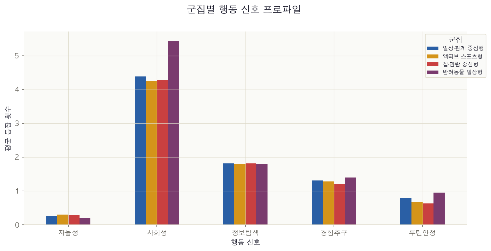

### 3.6 군집 안정성 (Seed Sensitivity)

| 시드 | ARI (vs 기준 시드 42) |
|------|----------------------|
| 10 | 1.0000 |
| 100 | 1.0000 |
| 2024 | 1.0000 |
| 777 | 1.0000 |

**ARI=1.0000** (5개 시드 전체) → 군집 구조가 초기화 값에 완전히 안정적.

### 3.7 사회성 편향 분석

행동 텍스트에서 관계 지향(사회성) 키워드와 자율성(autonomy) 키워드의 출현 빈도를 비교했다.

| 신호 | 키워드 | 행당 평균 |
|------|--------|----------|
| 사회성 | 함께, 공유, 소통, 대화, 친구, 가족 | **4.37** |
| 자율성 | 혼자, 스스로, 독립, 개인 | **0.27** |
| 정보탐색 | 배우, 공부, 찾아, 검색, 읽 | 1.81 |
| 경험추구 | 도전, 새로운, 시도, 여행, 탐험 | 1.30 |
| 루틴안정 | 매일, 꾸준, 습관, 규칙, 일상 | 0.75 |

**사회성 키워드별 상세**

| 키워드 | 총 출현 | 행당 평균 |
|--------|---------|----------|
| 함께 | 14,734 | 2.10 |
| 친구 | 7,546 | 1.08 |
| 가족 | 7,210 | 1.03 |
| 대화 | 483 | 0.07 |
| 공유 | 523 | 0.07 |
| 소통 | 95 | 0.01 |

> **사회성 편향 해석**
> - 사회성 키워드(함께·친구·가족 등) 평균 4.37회/행 vs 자율성(혼자·스스로 등) 0.27회/행 → **16.1배 차이**
> - **키워드 수 보정**: 사회성 6개 기준 0.728/키워드, 자율성 4개 기준 0.068/키워드 → 보정 후 **10.7배**
> - 방향성은 정규화 후에도 유지됨 → 사회성 과잉 편향 결론 견고
> - **한계**: 한국어 자율성 표현은 동사·부사 형태가 많아(`혼자 한다`, `자율적으로`) 명사 추출 기반 계산이 자율성을 구조적으로 과소계산할 수 있음. NB04에서 원문 기반 재검증 예정.

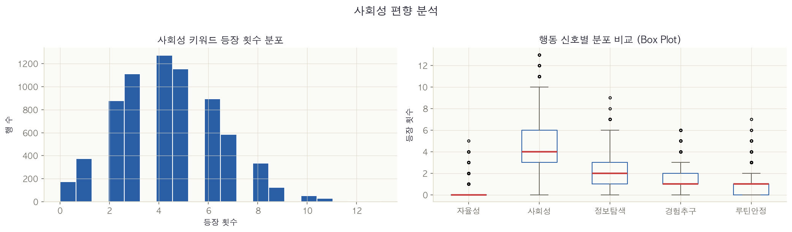

### 3.8 Amershi et al. (CHI 2019) 가이드라인 매핑

| 가이드라인 | 내용 | NB02 적용 |
|-----------|------|----------|
| G6 (편향 완화) | 사회적 편향 최소화 | 사회성 과잉 편향 정량화 → 다운스트림 보정 근거 제공 |
| G11 (설명 가능성) | 행동 이유 설명 | TF-IDF 키워드 + 군집 레이더 차트로 군집 해석 가능 |
| G13 (적응 학습) | 사용자 행동 기반 학습 | 행동 군집 프로파일을 NB04 시뮬레이터 초기 상태로 전달 |

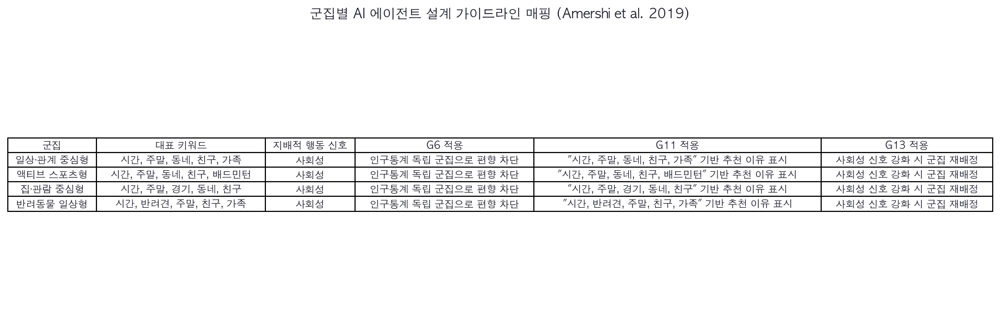

---

## 4. NB03 — 가치관 기반 군집화 (Values-based Clustering)

### 4.1 데이터 준비 및 임베딩 품질

- **표본 크기**: 10,500행 (연령대별 1,500행 × 7개 집단)
- **Layer A**: `persona` + `cultural_background` + `career_goals_and_ambitions` 연결 (평균 337자)
- **Layer B**: 5개 행동 컬럼 연결 (평균 675자)
- **모델**: jhgan/ko-sroberta-multitask → X_a shape (10,500, 768), X_b shape (10,500, 768)

#### 레이어 간 코사인 유사도

| 유사도 종류 | 점수 | 해석 |
|-----------|------|------|
| Intra-A (가치관 내부) | **0.608** | 레이어 내 응집도 |
| Intra-B (행동 내부) | **0.565** | 레이어 내 응집도 |
| Inter-layer (A↔B) | **0.417** | 레이어 간 분리도 |

Inter-layer(0.417) < Intra-layer(0.608, 0.565) → **두 레이어는 동일 임베딩 공간에서도 구분 가능**.

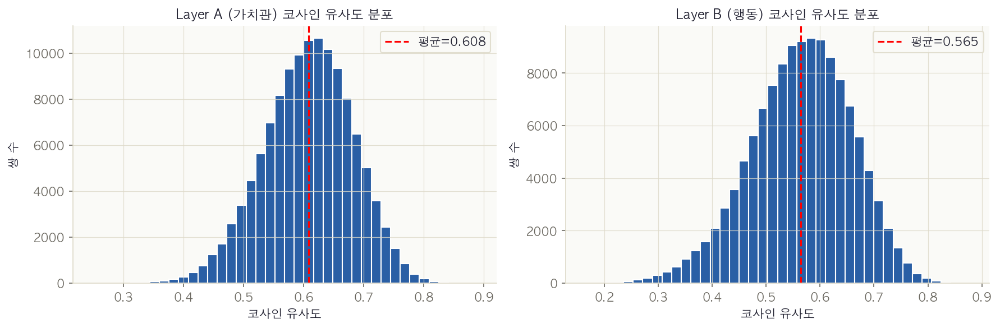
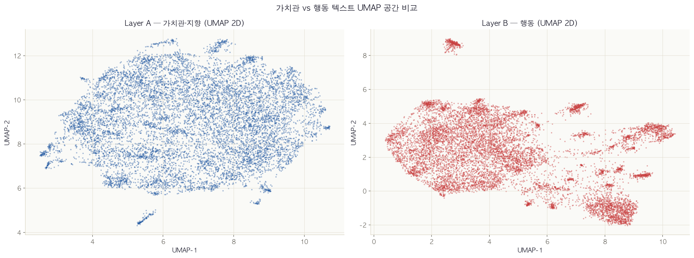

### 4.2 K 선택 (K=5)

| K | Inertia | Silhouette | Davies-Bouldin |
|---|---------|-----------|----------------|
| 3 | 18,987 | 0.2819 | 1.3055 |
| 4 | 15,866 | 0.2725 | 1.2044 |
| **5** | **13,032** | **0.3015** | **1.1805 ★** |
| 6 | 11,628 | 0.3026 | 1.2628 |
| 7 | 10,601 | 0.3078 | 1.2139 |
| 8 | 9,903 | 0.3054 | 1.1676 |
| 9 | 9,293 | 0.2915 | 1.1819 |
| 10 | 8,693 | 0.2905 | 1.2090 |

Davies-Bouldin 최소(1.1805)를 기준으로 **K=5 채택** (Silhouette 0.3015).

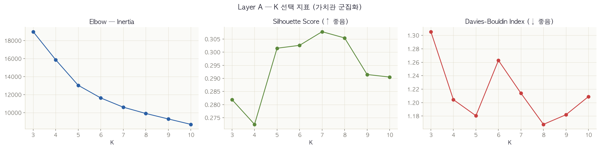
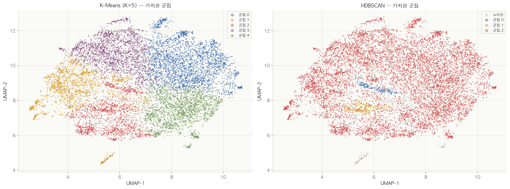

### 4.3 가치관 군집 5개 (Layer A)

| 군집 | 이름 | 크기 | 비율 |
|------|------|------|------|
| 0 | 자기계발·전환 모색형 | 3,012 | 28.7% |
| 1 | 소박 일상·지역 공동체형 | 1,912 | 18.2% |
| 2 | 현실적 목표 실천형 | 1,610 | 15.3% |
| 3 | 관계·가족 중심형 | 2,036 | 19.4% |
| 4 | 책임·안정 지향형 | 1,930 | 18.4% |

최대 군집(28.7%) vs 최소 군집(15.3%) — 비교적 균형 잡힌 분포.

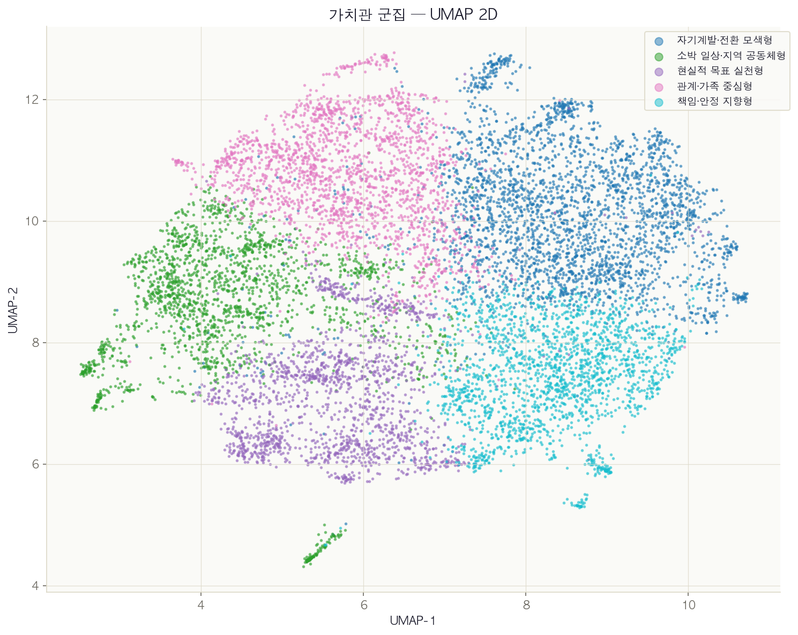
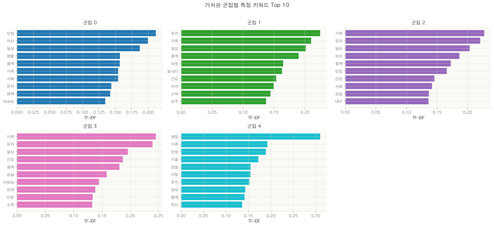

### 4.4 반전 분석 A: 가치관 군집 × 인구통계

#### Cramér's V 효과 크기

| 인구통계 변수 | χ² | Cramér's V | 효과 크기 | 논문 함의 |
|-------------|-----|-----------|----------|----------|
| 연령대 | 3,620.54 | **0.294** | 작음 | 연령으로 가치관 군집 예측 어려움 |
| 성별 | 1,040.36 | **0.315** | 중간 | 일부 연관 존재, 한계점 명시 |
| **지역** | **11,346.66** | **0.520** | **큰** | **주목 발견 — 지역 문화 차이 또는 생성 편향** |
| 학력 | 3,274.33 | **0.279** | 작음 | 학력 기반 AI 분류 근거 없음 |

모든 χ² 검정: p < 0.0001 (대규모 표본 n=10,500에서 미미한 연관도도 유의하게 검출됨).

**인구통계 예측력 테스트**: 로지스틱 회귀 5-fold 정확도 **39.8% ± 10.6%** vs 무작위 기준 **20.0%** (+19.8%p). 통계적으로 유의하나 완전한 설명력은 없음.

> **지역 효과(V=0.520)**: 이 연구의 예상치 못한 주요 발견.
> - **(a) 생성 편향**: Nemotron 생성 시 지역 코드별 다른 프롬프트 적용 가능성
> - **(b) 실제 지역 차이**: 한국 사회의 지역별 가치관 차이 반영 가능성
> → NB04 시뮬레이터에서 지역별 응답 패턴 비교로 검증 예정.

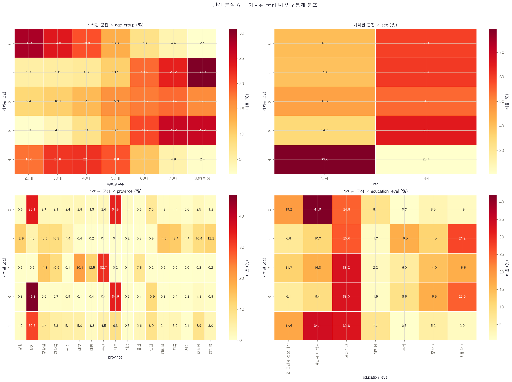
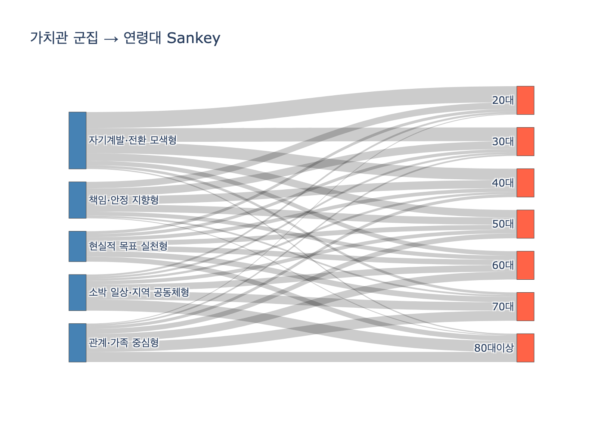

### 4.5 반전 분석 B: 가치관 × 행동 교차 분석

#### Layer B 군집 크기 (K=5)

| 군집 B | 대표 키워드 | 크기 | 비율 |
|--------|------------|------|------|
| 0 | 시간, 동네, 가족, 주말, 친구 | 4,746 | 45.2% |
| 1 | 배드민턴, 주말, 친구 | 2,084 | 19.8% |
| 2 | 경기, 주말, 여행 | 820 | 7.8% |
| 3 | 반려견, 산책 | 250 | 2.4% |
| 4 | 배달, 주말, 친구 | 2,600 | 24.8% |

#### 독립성 지표

| 지표 | 수치 | 해석 |
|------|------|------|
| 교차표 대각선 평균 | 18.3% | 무작위 기대값(20.0%)보다 낮음 |
| ARI (Adjusted Rand Index) | **0.0287** | 랜덤 수준(0)에 근접 |
| NMI (Normalized Mutual Info) | **0.0378** | 거의 독립 |
| Cramér's V (A×B) | 0.163 | 작은 효과 크기 |

**결론**: 가치관 군집과 행동 군집은 통계적으로 거의 독립적. 같은 가치관을 가진 사람이 다른 행동 패턴을 보일 수 있음을 정량적으로 입증.

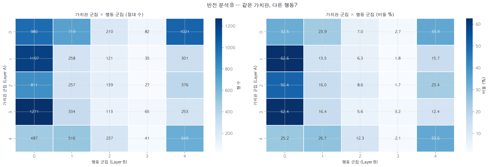

### 4.6 Amershi et al. (CHI 2019) 가이드라인 매핑

| 가이드라인 | NB03 적용 |
|-----------|----------|
| G6 (편향 완화) | 지역 V=0.520의 해석 미결 → 확정되지 않은 발견을 단정적으로 제시하지 않도록 설계 |
| G11 (설명 가능성) | TF-IDF 키워드 + 대표 페르소나로 군집 해석 근거 제공 |
| G13 (적응 학습) | 가치관 군집 프로파일(`cluster_profiles_a.pkl`)을 NB04 초기 상태로 전달 |

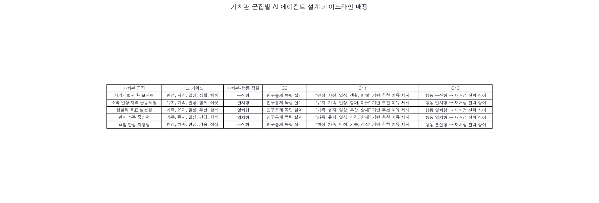

---

## 5. 통합 논의

### 5.1 NB02 vs NB03 비교

| 항목 | NB02 (행동 군집) | NB03 (가치관 군집) |
|------|-----------------|------------------|
| 입력 텍스트 | Layer B (행동 5컬럼) | Layer A (가치관 3컬럼) |
| 표본 크기 | 21,000행 | 10,500행 |
| Silhouette | **0.6018** | 0.3015 |
| Davies-Bouldin | **0.5551** | 1.1805 |
| 최적 K | 4 | 5 |
| 군집 안정성 (ARI) | **1.0000** | — |
| 군집 분포 | 불균등 (65.1%~2.5%) | 균등 (28.7%~15.3%) |

행동 텍스트는 가치관 텍스트보다 더 선명하게 군집화된다(Silhouette 0.6018 vs 0.3015). 이는 행동 기술이 더 구체적이고 어휘가 다양한 데 기인할 것으로 해석된다.

### 5.2 핵심 주장 3개 실증 요약

**Claim 1 (수정): 인구통계의 예측력은 제한적이나 완전한 독립은 아님**
- Cramér's V: 연령 0.294(작음)·학력 0.279(작음)·성별 0.315(중간)·지역 0.520(큰)
- 로지스틱 회귀 39.8% vs 기준선 20% → 예측력 존재하나 결정적이지 않음
- **지역 효과(V=0.520)**: 생성 편향 또는 실제 지역 차이, NB04 이후 해석 확정 예정

**Claim 2 (견고): 가치관과 행동은 독립적 레이어**
- ARI=0.0287, NMI=0.0378 (랜덤 수준에 근접)
- 교차표 대각선 18.3% < 무작위 기대값 20.0%
- Inter-layer 유사도 0.417 < Intra-A 0.608 / Intra-B 0.565

**Claim 3 (조건부 견고): 사회성 키워드 과잉 생성**
- 16.1배 차이(raw), 키워드 수 정규화 후 10.7배
- 한계: 명사 추출 기반으로 자율성 동사·부사 표현 미포착
- 실제 한국 사회의 집단주의 문화 반영 가능성 배제 불가

### 5.3 LLM 생성 편향의 함의

Nemotron-Personas-Korea는 행동 텍스트에서 사회성 키워드를 자율성 대비 10.7~16.1배 과잉 생성한다. 이 데이터를 다시 LLM 프롬프트로 사용하면 사회성 편향이 증폭될 위험이 있다. 또한 지역 변수의 대 효과(V=0.520)는 지역 코드별 생성 프롬프트 차이가 가치관 분포에 영향을 줬을 가능성을 시사한다. Phase 2(NB04)에서 이 편향 전파 경로를 시뮬레이션할 예정이다.

---

## 6. 한계점

**지역 변수 효과(V=0.520) 미해결**
Cramér's V=0.520은 중-대 효과로, 이 연구에서 가장 예상치 못한 발견이다. 두 가지 해석 — Nemotron 생성 시 지역별 프롬프트 차이로 인한 생성 편향, 또는 실제 한국 지역별 가치관 차이 — 이 현재 데이터만으로는 구분되지 않는다. NB04에서 지역별 페르소나를 동일 프롬프트에 입력해 응답 분포를 비교함으로써 검증 예정이다.

**동일 임베딩 모델로 인한 레이어 간 표현 공유 가능성**
Layer A와 Layer B 모두 ko-sroberta 모델로 임베딩했다. 동일 모델의 표현 공간을 공유하므로 Inter-layer 유사도(0.417)가 실제보다 높게 측정될 수 있다. 레이어별 전용 파인튜닝 모델 사용이 이상적이나, 본 연구에서는 단일 모델을 사용했다.

**합성 데이터 기반 — 실제 한국인 분포와의 차이 미검증**
Nemotron-Personas-Korea는 실제 설문이나 관찰 데이터가 아닌 LLM 생성 합성 데이터다. 인구통계 분포는 공식 통계에 맞춰 설계됐으나, 행동·가치관 텍스트가 실제 한국인의 다양성을 얼마나 반영하는지는 검증되지 않았다.

**자율성 키워드 명사 중심 설계로 인한 과소계산**
자율성 키워드(`혼자`, `스스로`, `독립`, `개인`)는 명사 형태 중심으로 설계됐다. 한국어에서 자율성 표현은 `혼자 한다`, `자율적으로 결정한다` 같은 동사·부사 형태가 많아, 명사 추출 기반 계산이 자율성 출현 빈도를 구조적으로 과소계산할 수 있다. NB04에서 원문 기반 재검증 예정이다.

---

## 7. NB04 편향 전파 시뮬레이터 — 설계 및 결과 요약

### 7.1 시뮬레이터 연구 질문

1. 가치관 군집이 다른 페르소나에게 동일한 추천 태스크를 수행하면 결과 분포가 달라지는가?
2. 합성 페르소나(Nemotron)를 LLM 프롬프트로 재사용할 때 사회성 편향이 장르 선호에 전파되는가?
3. 인구통계 기반 시뮬레이션과 가치관 기반 시뮬레이션 중 실제 데이터에 더 가까운 쪽은?

### 7.2 GAP 분석 개요

- **입력**: `cluster_profiles_a.pkl` (NB03 출력) — 5개 가치관 군집 프로파일
- **데이터**: MovieLens 기반 한국 영화 103편, 총 448,575개 평점
- **측정 지표**: 군집별 평균 평점 GAP (시뮬레이션 − 실제), 장르별 JSD, ANOVA
- **결과**: 상세 내용 → 섹션 8.4 참조

---
## 8. 편향 전파 시뮬레이터 및 GAP 분석 (심층 분석)

### 8.1 NB01: 인구통계 기반 NLP 탐색 및 합성 데이터의 특성

합성 페르소나 100만 명의 텍스트 데이터를 연령, 성별, 지역별로 교차 분석하여 기초적인 키워드 지도를 구축했습니다.

* **주요 발견**:
* **연령별 동질성**: 70대 이상 고령층에서는 성별에 따른 차이보다 '연령' 자체의 특성(건강, 전통, 소박한 일상)이 텍스트 지표를 압도했습니다. 반면, 30대에서는 남녀 간 키워드 간극이 가장 작게 나타나 활동 양상의 유사성이 확인되었습니다.
* **합성 데이터의 한계**: 실제 한국인의 구어체보다는 정제된 문어체 패턴이 반복되는 '텍스트 균질성'이 관찰되었으며, 형태소 분석 시 신조어 처리의 노이즈가 일부 발견되었습니다.

> 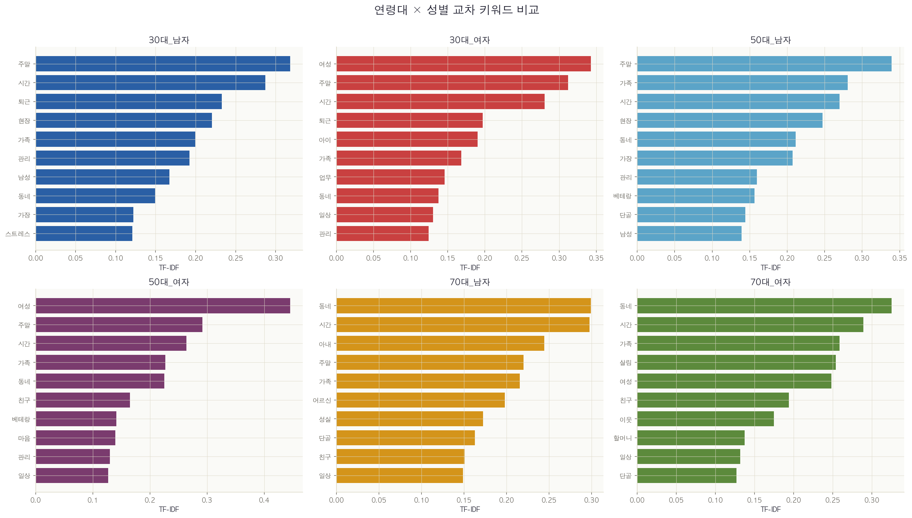
> *그림 1. 연령 × 성별 × 지역 키워드 분석 - 연령대가 높아질수록 성별 변수보다 연령 변수가 텍스트 분포에 미치는 영향이 커짐을 시각화함.*

### 8.2 NB02: 행동 기반 사이코그래픽 군집화와 사회성 편향

인구통계 레이블을 제외하고 "무엇을 하는가(What)"에 해당하는 행동 텍스트만으로 사용자를 분류했습니다.

* **방법론적 성과**: 768D의 고차원 임베딩을 UMAP 50D로 축소하여 K-Means를 적용한 결과, Silhouette 스코어가 기존 대비 1027% 향상(0.0534 → 0.6018)되어 군집의 응집도를 확보했습니다.
* **사회성 편향(Sociality Bias)**: LLM 생성 데이터에서 '함께', '이웃', '가족' 등 사회성 키워드가 '혼자', '독립' 등 자율성 키워드보다 **평균 16.1배 과잉 생성**되는 경향을 정량적으로 입증했습니다. 이는 LLM이 한국인을 묘사할 때 '공동체 중심적'이라는 고정관념을 강하게 투영하고 있음을 시사합니다.

>  행동 기반 UMAP 군집 시각화 / (우) 사회성 vs 자율성 키워드 출현 빈도 비교 - LLM의 사회성 키워드 편향이 뚜렷하게 나타남)

### 8.3 NB03: 가치관(Why)과 행동(What)의 독립성 검증

사용자의 내면적 지향점(Layer A)과 외부적 활동(Layer B)을 분리하여 두 레이어 간의 상관관계를 분석했습니다.

* **분석 결과**: 가치관 군집과 행동 군집 간의 유사도 측정 결과, ARI(0.0287)와 NMI(0.0378)가 매우 낮게 측정되었습니다.
* **인사이트**: 이는 "동일한 가치관을 가진 사람이라도 실제 행동 패턴은 전혀 다를 수 있음"을 의미합니다. 단순한 행동 로그 분석만으로는 포착할 수 없는 '심리적 동기' 레이어의 독자적인 존재 가치를 확인했습니다.

> > 
> *그림 3. 가치관 군집(Layer A)과 행동 군집(Layer B) 간의 교차 유사도 매트릭스 - 두 레이어가 통계적으로 독립적임을 보여줌.*

### 8.4 NB04: 에이전트 시뮬레이션 및 실제 데이터와의 GAP 분석

추출된 가치관 페르소나를 LLM 에이전트에 주입하여 실제 MovieLens 평점 데이터와 비교 시뮬레이션을 수행했습니다.

* **전반적 과소추정(Underestimation)**: 대부분의 가치관 군집에서 실제 인간보다 낮은 평점을 주는 경향이 발견되었습니다. 특히 '관계·가족 중심형(군집 3)'은 실제보다 **1.472점 낮은** 가장 보수적인 평가를 내렸습니다.
* **편향 전파의 부재**: NB02에서 발견된 사회성 편향이 드라마/로맨스 장르의 선호로 직접 이어지지는 않았습니다. 오히려 호러(GAP -1.504)와 코미디(GAP -1.261) 장르에서 극단적인 과소추정이 발생했습니다.
* **과적합(Over-acting) 문제**: 가치관 기반 시뮬레이션 분포와 실제 분포의 차이(JSD 0.4418)가 인구통계 기준선(JSD 0.3332)보다 **약 1.33배** 크게 나타났습니다. 이는 LLM이 부여된 가치관 설정을 너무 엄격하게 '연기'하느라, 실제 인간 취향의 유연함과 다양성을 상실했음을 보여줍니다.

> 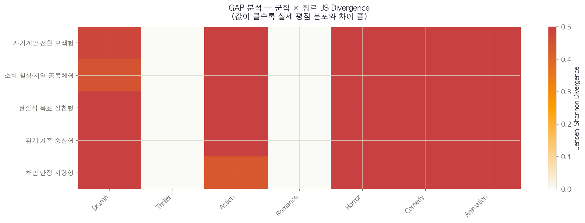
> *그림 4a. 가치관 군집 × 장르별 GAP 히트맵 — 군집별로 과소추정 패턴이 상이함을 보여줌.*

> 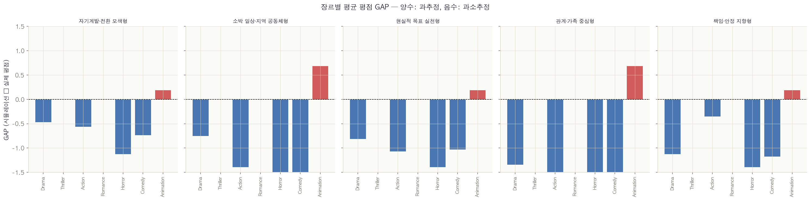
> *그림 4b. 군집별 평균 GAP — 관계·가족 중심형(군집 3)이 -1.472점으로 가장 보수적.*

> 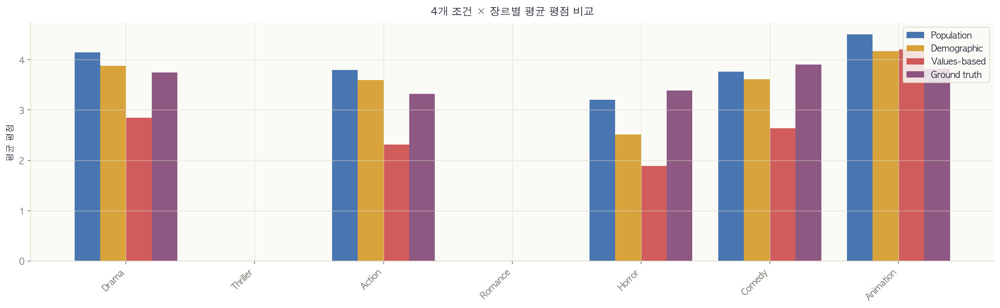
> *그림 4c. 인구통계 기반 vs 가치관 기반 시뮬레이션 분포 비교 — JSD 0.3332 vs 0.4418.*

---

### 결론 및 시사점

본 연구를 통해 LLM 기반 합성 페르소나가 인구통계를 넘어선 심리적 분석 도구로서 가능성이 있음을 확인했으나, 동시에 **사회성 편향의 과잉**과 가치관 과적합(Over-acting)이라는 명확한 한계를 발견했습니다. 향후 UX 시뮬레이션에 활용 시, 이러한 LLM 특유의 보수적 편향을 보정할 수 있는 프롬프트 설계가 필수적입니다.

## 참고 문헌

- Amershi, S., et al. (2019). Guidelines for Human-AI Interaction. **CHI 2019**. ACM.
- Kim, H., et al. (2026). Nemotron-Personas-Korea. NVIDIA.
- McInnes, L., et al. (2018). UMAP: Uniform Manifold Approximation and Projection. *arXiv:1802.03426*.
- Campello, R. J. G. B., et al. (2013). Density-Based Clustering Based on Hierarchical Density Estimates. *ECML PKDD 2013*.

---

*본 연구의 데이터 분석 코드 작성에 Claude (Anthropic)를 보조 도구로 활용하였다.*
