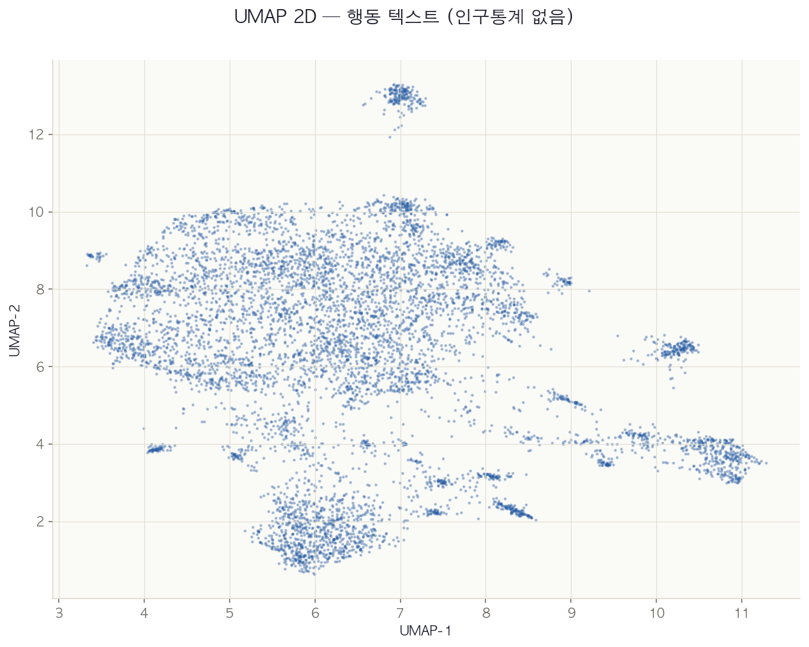
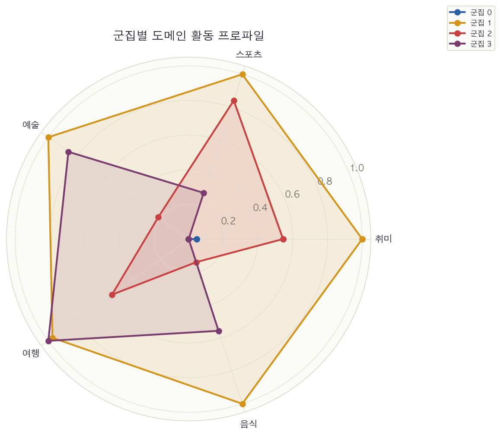

# beyond-demographics-kr
> LLM이 생성한 합성 한국어 페르소나 데이터에서, 인구통계 없이 행동·가치관 텍스트만으로 의미 있는 사이코그래픽 군집을 추출할 수 있는가?

   

## 연구 질문

1. 행동 텍스트만으로 인구통계와 독립적인 사이코그래픽 군집 추출이 가능한가?
2. 가치관 텍스트와 행동 텍스트는 독립적인 레이어를 형성하는가?
3. LLM이 생성한 한국어 페르소나에서 사회성 키워드가 과잉 표현되는가?

## 데이터셋

Nemotron-Personas-Korea (NVIDIA, 2026) — 100만 행, 합성 한국인 페르소나

## 파이프라인


## 핵심 발견

| 발견 | 수치 |
|------|------|
| UMAP 파이프라인 효과 | 768D Sil=0.0534 → 50D Sil=0.6018 (+1027%) |
| 행동 군집 안정성 | ARI=1.0000 (5개 시드) |
| 사회성 편향 | 사회성 4.37/행 vs 자율성 0.27/행 (16.1×) |
| 가치관-행동 독립성 | 교차 Heatmap 대각선 평균 18.3%, ARI=0.0287, NMI=0.0378 |
| 인구통계 독립성 | 행동·가치관 군집 모두 연령·성별 Heatmap 편중 없음 |
| 전반적 과소추정 (NB04) | 군집 3(관계·가족) GAP -1.472점으로 최대, 호러 -1.504 / 코미디 -1.261 |
| 과적합(Over-acting) (NB04) | 가치관 JSD 0.4418 vs 인구통계 기준선 JSD 0.3332 (~1.33배) |
| 개인화 효과 (NB04) | 군집 간 평점 분산 std=0.3334, ANOVA p<0.05 (모든 장르 유의) |

### 행동 군집 — UMAP 공간


### 가치관 군집 × 행동 도메인 프로파일



## 가치관 군집 (NB03, K=5)

| ID | 군집명 | 비율 |
|----|--------|------|
| 0 | 자기계발·전환 모색형 | 28.7% |
| 1 | 소박 일상·지역 공동체형 | 18.2% |
| 2 | 현실적 목표 실천형 | 15.3% |
| 3 | 관계·가족 중심형 | 19.4% |
| 4 | 책임·안정 지향형 | 18.4% |

## 한계점

- 지역 변수 중-대 효과(Cramér's V=0.520): 생성 편향 vs 실제 지역 차이 미분리
- 동일 임베딩 모델로 두 레이어를 인코딩해 공유 표현 편향 가능성
- 합성 데이터 기반 — 실제 한국인 분포와의 차이 미검증
- 자율성 키워드가 명사 중심 설계로 동사·부사형 표현 과소계산

## 설치 및 실행

```bash
git clone https://github.com/lucytheboss/beyond-demographics-kr
cd beyond-demographics-kr
pip install -r requirements.txt
```

실행 순서: NB01 → NB02 → NB03 → NB04

## 인용

```bibtex
@misc{roh2026beyond,
  title={Beyond Demographics: Psychographic Clustering of LLM-Generated Korean Persona Data},
  author={Roh, Lucy},
  year={2026},
  note={Undergraduate independent research}
}
```

## Acknowledgements

본 연구의 데이터 분석 코드 작성에 Claude (Anthropic)를 보조 도구로 활용하였다.
데이터셋: NVIDIA Nemotron-Personas-Korea (Hyunwoo Kim et al., 2026)