# Analysis Notes — Nemotron-Personas-Korea

## 1. 데이터 개요

| 항목 | 수치 |
|------|------|
| 전체 행 수 | 1,000,000건 |
| 컬럼 수 | 26개 |
| 결측값 | 전 컬럼 0% |
| 성별 | 여자 50.4% / 남자 49.6% |
| 평균 나이 | 50.7세 (범위: 19–99세) |
| 결혼 여부 | 배우자있음 59.3% / 미혼 25.7% |
| 최다 학력 | 고등학교 33.1% |
| 최다 지역 | 경기 26.2% / 서울 18.5% |

**연령 분포**: 50대(~200,000명)가 최다, 60대(~180,000명)가 2위. 40대·30대·20대 순으로 감소. 전반적으로 중·장년층 집중 분포. 10대 및 90대 이상은 극소수.

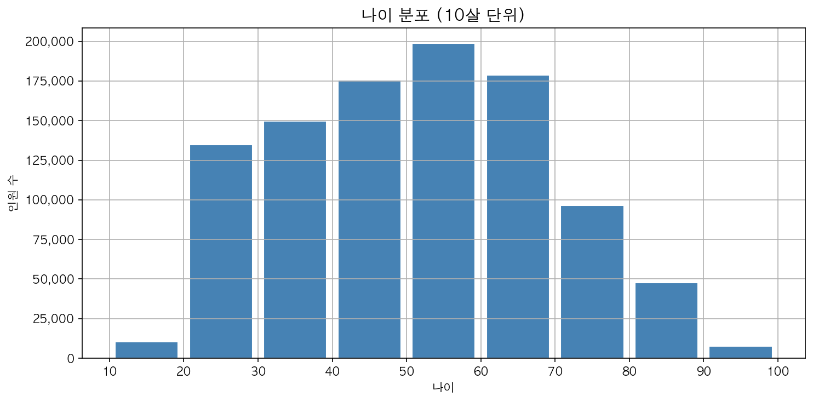
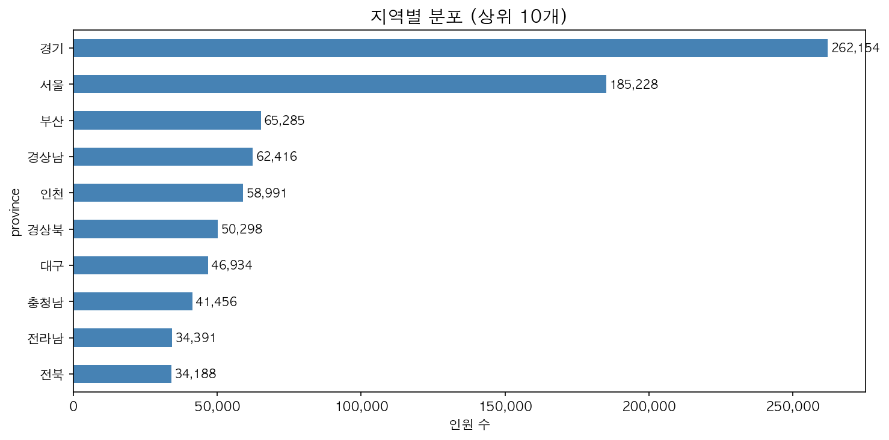
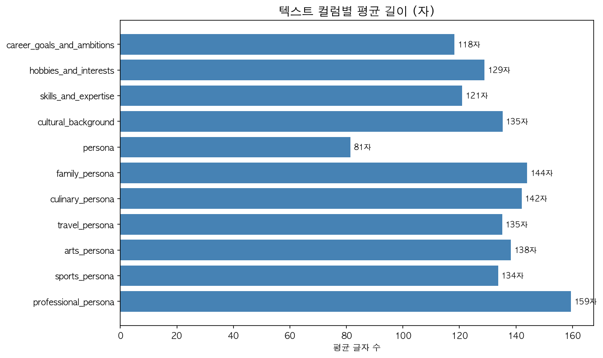

---

## 2. 연령대별 특성

### 키워드 (TF-IDF Top 10)

| 연령대 | 주요 키워드 |
|--------|------------|
| 20대 | 시간, 주말, 친구, 청년, 퇴근, 자신, 준비, 동네, 관리, 안정 |
| 30대 | 주말, 시간, 퇴근, 가족, 관리, 현장, 동네, 업무, 아이, 일상 |
| 40대 | 주말, 가족, 시간, 동네, 현장, 퇴근, 관리, 여성, 일상, 정리 |
| 50대 | 주말, 시간, 가족, 동네, 현장, 베테랑, 관리, 여성, 친구, 단골 |
| 60대 | 시간, 동네, 주말, 가족, 친구, 관리, 여성, 단골, 일상, 건강 |
| 70대 | 동네, 시간, 가족, 친구, 주말, 이웃, 단골, 어르신, 일상, 살림 |
| 80대이상 | 동네, 시간, 가족, 여르신, 살림, 평생, 집안, 친구, 이웃, 노래 |

### 인사이트

- **20대**: `청년`, `친구`, `자신`, `안정`이 두드러짐 — 자기 정체성 형성·미래 준비 서사
- **30대**: `퇴근`, `업무`, `아이` 공존 — 커리어와 양육의 병행 시기
- **40–50대**: `베테랑`(50대 특이 등장), `현장`, `가족` 중심 — 직업적 숙련도와 가정 안정
- **60대 이후**: `건강`, `이웃`, `단골`, `어르신`, `살림`이 점진적으로 부상 — 지역 커뮤니티·일상 루틴 중심으로 이동
- **70–80대**: `주말` 비중 감소, `동네·이웃` 비중 증가 — 반경이 좁아지고 관계의 깊이 강조

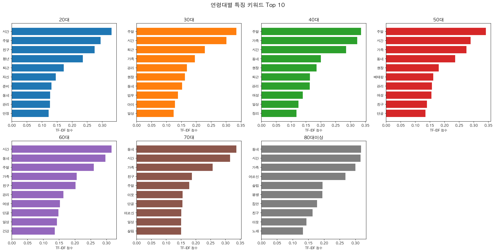
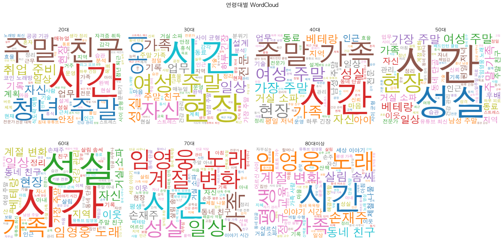
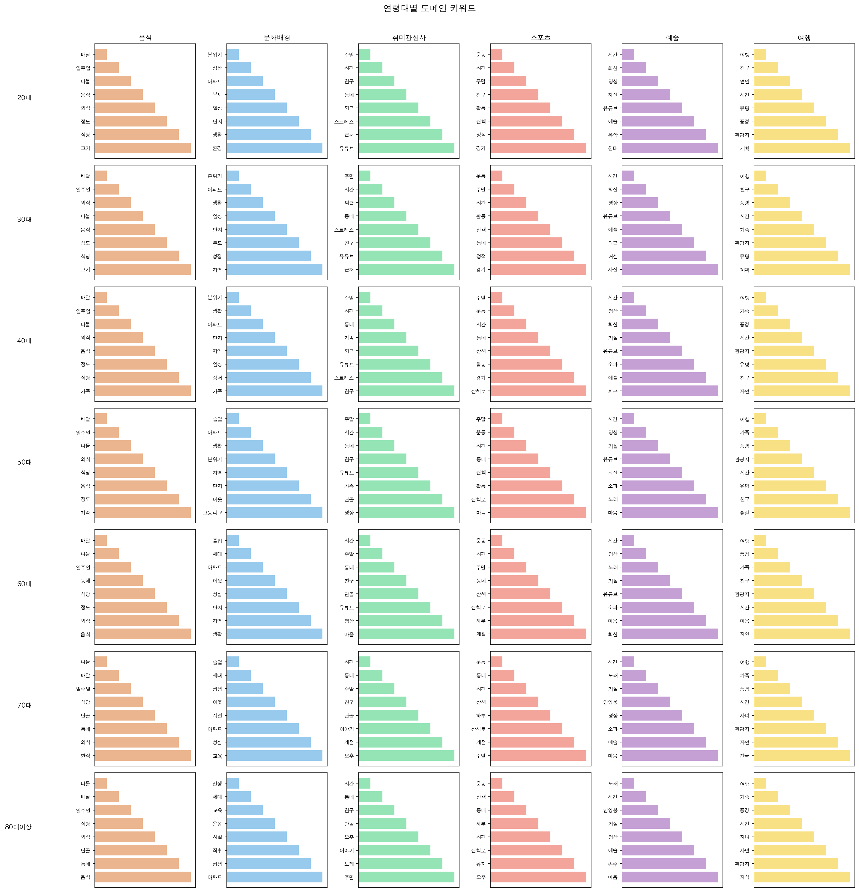

---

## 3. 지역별 특성

### 키워드 (TF-IDF Top 10)

| 지역 | 특징 키워드 |
|------|------------|
| 경기 | 주말, 시간, 가족, 동네, 관리, 친구, 현장, 일상, 여성, 수원 |
| 서울 | 시간, 주말, 동네, 가족, 친구, 관리, 일상, 여성, 단골, 현장 |
| 부산 | **부산**, 시간, 주말, 동네, 가족, 해운대, 친구, 관리, 현장, 일상 |
| 인천 | **인천**, 부평, 주말, 시간, 가족, 동네, 미추홀구, 현장, 친구, 남동구 |
| 경상남 | **창원**, 시간, 주말, **마산**, 동네, 가족, 친구, **진주**, 현장, **김해** |
| 경상북 | **구미**, **포항**, 시간, 주말, 동네, 가족, 친구, **경산**, 현장, 일상 |
| 대구 | **대구**, 시간, 주말, **달서구**, 동네, 가족, **팔공산**, **수성구**, 친구, **달성군** |
| 충청남 | **천안**, 시간, 주말, 동네, 가족, **서산**, **아산**, 친구, **당진**, 현장 |

### 인사이트

- **지역명 자기참조**: 부산·인천·대구 등 광역시는 지역명 자체가 최상위 TF-IDF를 기록 — 해당 지역 정체성이 페르소나 텍스트에 직접 반영됨
- **세부 지명 등장**: 경상남(창원·마산·진주·김해), 경상북(구미·포항), 충청남(천안·아산·당진) 등 시·군 단위 지명이 도내 특징 키워드로 등장
- **대구**: `팔공산`, `달서구`, `수성구` 등 구체적 지명 밀도 가장 높음 — 지역 내 다양성 표현
- **서울·경기**: 특정 지명보다 `일상`, `관리`, `친구` 등 일반적 생활 키워드 강세 — 지역 정체성보다 도시 생활 패턴 묘사

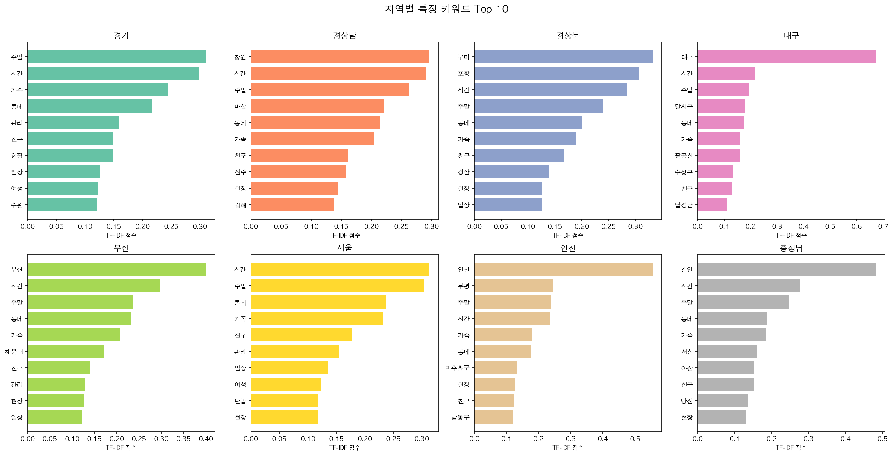
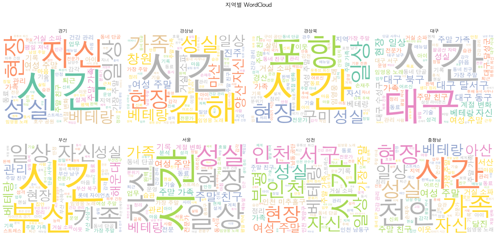

---

## 4. 성별 특성

### 키워드 (TF-IDF Top 15)

| 남자 | 여자 |
|------|------|
| 주말, 시간, 가족, 동네, 현장 | 시간, 주말, 여성, 동네, 가족 |
| 관리, 친구, 가장, 단골, 퇴근 | 친구, 일상, 관리, 살림, 마음 |
| 성실, 일상, 유튜브, 정리, 남성 | 정리, 유튜브, 퇴근, 단골, 자신 |

### 인사이트

- **남자**: `가장`, `현장`, `성실`, `남성` — 생계·책임·직업 정체성 키워드 상대적 강세
- **여자**: `여성`, `살림`, `마음`, `자신` — 내면적·관계적·일상 관리 표현이 두드러짐
- **공통**: `주말`, `시간`, `가족`, `동네`, `친구`는 성별 공유 키워드 — 생활 반경의 공통성
- `유튜브`는 남녀 모두 하위권에 등장 — 미디어 소비가 공통 취미로 자리잡은 반영

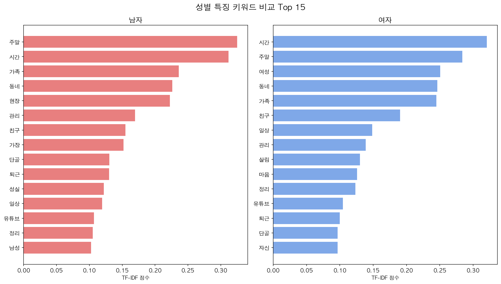
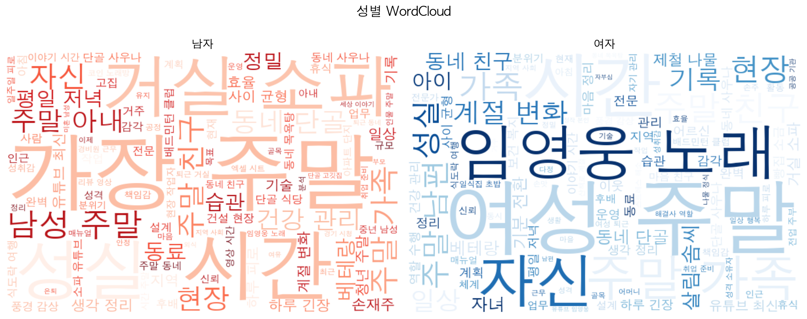
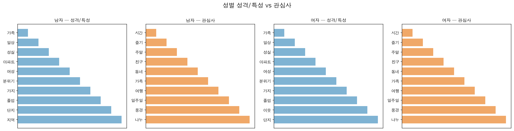

---

## 5. 도메인별 분석

### 성별 도메인 키워드

| 도메인 | 남자 | 여자 |
|--------|------|------|
| 음식 | 배달, 일주일, 식당, 음식, 나물, 외식, 정도, 식사 | 배달, 나물, 일주일, 외식, 음식, 정도, **한식**, **고기** |
| 문화배경 | 분위기, 아파트, 지역, 졸업, 성장, 단지, **현장**, **세대** | 아파트, 단지, 생활, 졸업, 분위기, **이웃**, 지역, **일상** |
| 취미관심사 | 주말, 시간, 동네, 친구, 아내, 단골, 유튜브, 퇴근 | 주말, 시간, 동네, 친구, 유튜브, **마음**, **남편**, 단골 |
| 스포츠 | 주말, 운동, 시간, 경기, 동네, 산책, 활동, 친구 | 운동, 시간, 주말, 산책, 동네, **산책로**, 활동, **마음** |
| 예술 | 시간, 영상, 유튜브, 최신, 예술, 거실, 노래, **소파** | 시간, 최신, 영상, 거실, 유튜브, 노래, **자신**, **예술** |
| 여행 | 여행, 가족, 풍경, 친구, 시간, 관광지, 유명, **자연** | 여행, 가족, 풍경, 친구, 시간, 관광지, 유명, **마음** |

- 음식: 남자는 `식사·식당` 강조, 여자는 `한식·고기` 구체 품목 등장
- 스포츠: 남자는 `경기`, 여자는 `산책로` — 활동 유형의 미세한 차이
- 예술: 남자 `소파`(거실 수동 감상), 여자 `자신`(자기표현 강조)
- 여행: 남자 `자연`, 여자 `마음` — 목적지 vs 정서적 경험 차이

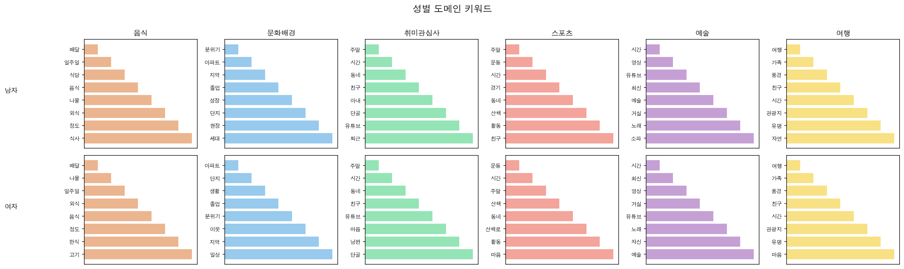

---

## 6. 연령 × 성별 교차 분석

| 그룹 | 특징 키워드 |
|------|------------|
| 30대_남자 | 주말, 시간, 퇴근, 현장, 가족, 관리, 남성, 동네, 가정, 스트레스 |
| 30대_여자 | **여성**, 주말, 시간, 퇴근, **아이**, 가족, 업무, 동네, 일상, 관리 |
| 50대_남자 | 주말, 가족, 시간, 현장, 동네, 가장, 관리, 베테랑, 단골, 남성 |
| 50대_여자 | **여성**, 주말, 시간, 가족, 동네, 친구, 베테랑, 마음, 관리, 일상 |
| 70대_남자 | 동네, 시간, **아내**, 주말, 가족, 어르신, 성실, 단골, 친구, 일상 |
| 70대_여자 | 동네, 시간, 가족, **살림**, **여성**, 친구, **이웃**, **할머니**, 일상, 단골 |

### 인사이트

- **30대_여자**: `아이`, `업무` 동시 등장 — 육아+직장 이중 부담 서사가 뚜렷
- **30대_남자**: `스트레스` 유일하게 등장 — 사회 진입·직장 적응기의 긴장 반영
- **50대_남자**: `베테랑`, `가장` — 직업적 정점과 가부장 역할 정체성의 공존
- **70대_남자**: `아내` 등장 — 은퇴 후 배우자 중심 생활로의 전환
- **70대_여자**: `할머니`, `살림`, `이웃` — 세대 정체성과 지역사회 역할 강화

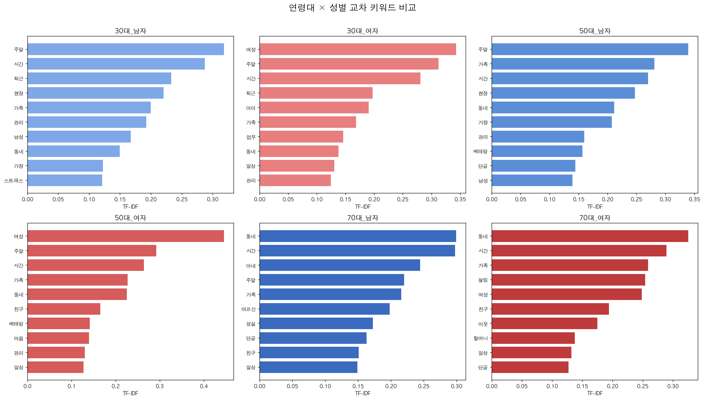

---

## 7. 연령 × 성별 × 지역 교차 히트맵

- **`부산`**: 30대·50대·70대 남녀 모두에서 짙은 TF-IDF 강도 — 지역 정체성이 연령·성별 초월해 일관되게 강함
- **`여성`**: 30대·50대 여성 그룹에서 집중 등장 — 성별 정체성 키워드가 특정 연령대에서 더 강하게 표현됨
- **`살림`**: 70대 여자에서만 두드러짐 — 연령·성별 교차점에서만 보이는 패턴
- **`퇴근`**: 30–50대 전반에 걸쳐 등장, 70대에서 소멸 — 경제활동 주기를 그대로 반영
- **`아내`**: 70대_남자에서만 특이하게 등장 — 은퇴 후 삶의 중심축 변화

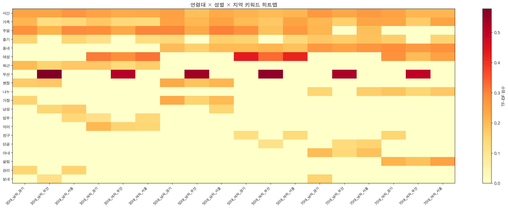

**WordCloud 샘플 (20–30대)**

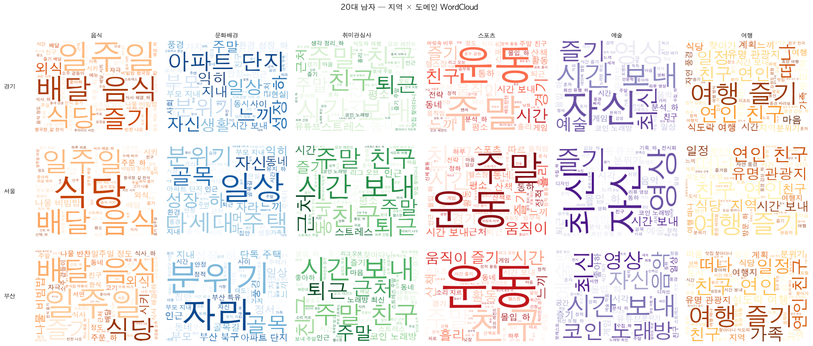
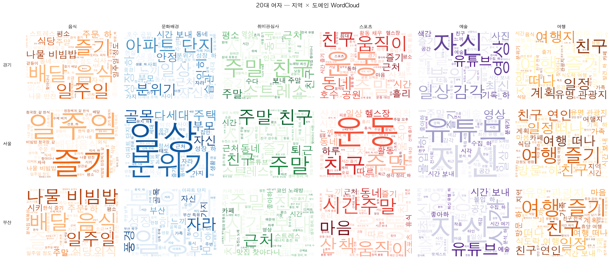
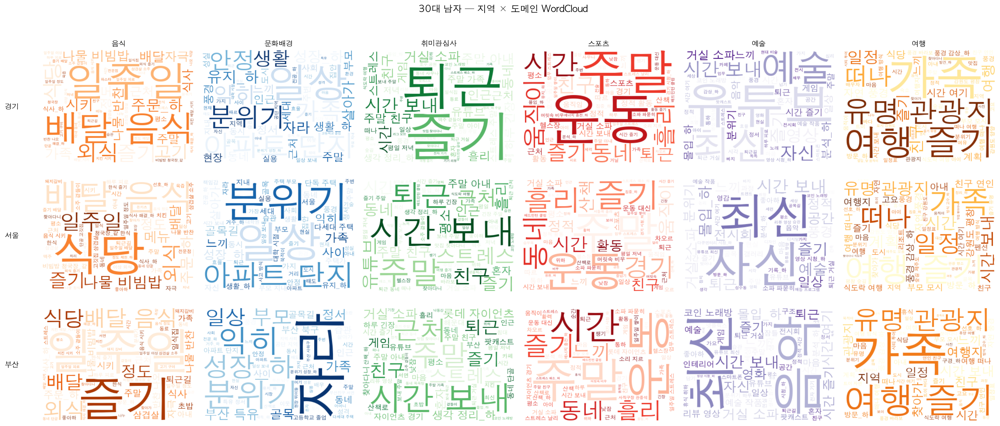
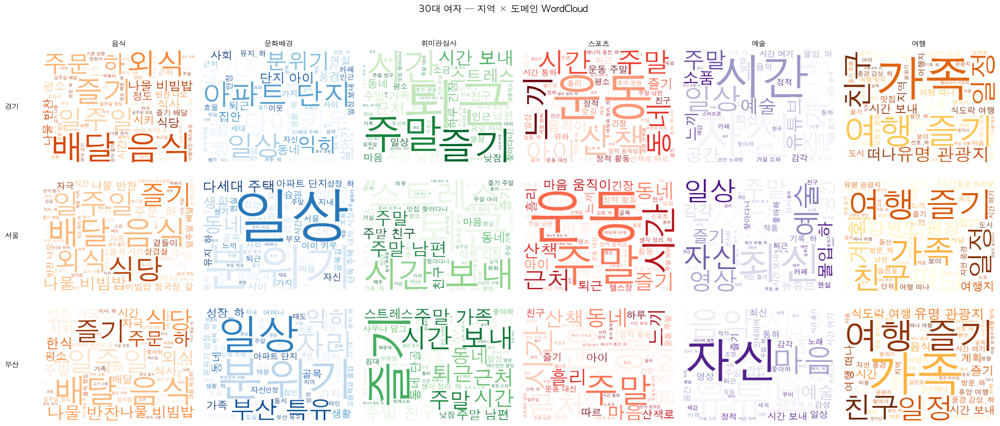

---

## 8. 한계

| 한계 | 내용 |
|------|------|
| 합성 데이터 | NVIDIA 생성 모델의 결과물 — 실제 한국 인구 행동과 차이 가능 |
| 형태소 분석 오류 | `kiwipiepy` 복합어·신조어 분절 오류 발생 가능 |
| TF-IDF 한계 | 절대 빈도 정보 소실; 짧은 컬럼(스포츠·예술)은 노이즈 비율 높음 |
| 균등 샘플링 | 소수 그룹 과대 대표, 다수 그룹 과소 대표 |
| 텍스트 균질성 | 합성 텍스트 특성상 어휘 다양성 과소평가 가능 |

## 9. 향후 과제

- 도메인별 감성 분석 (긍/부정 어휘 비율)
- 직업군(`professional_persona`) × 연령 교차 분석
- 임베딩 기반 유사 페르소나 검색
- 실제 SNS·설문 데이터와 비교 검증
